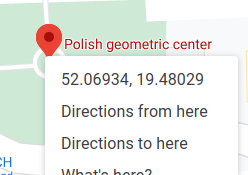

Przełączaj lokalizację między geoportal.gov.pl a Google Maps
----------------------------------------

## Instalacja

[Chrome Web Store](https://chrome.google.com/webstore/detail/lokalizacja-geoportalgovp/bmalpmchldgpfnonnkephcfpblhipdhm)

## Użycie

### Z Geoportal do Google Maps

1. Odwiedź https://mapy.geoportal.gov.pl
1. Poczekaj na pełne załadowanie strony (na dole będzie widać koordynaty zmieniające się wraz z poruszanym kursorem)
1. Nakieruj kursor na dowolne miejsce na mapie
1. Wciśnij skrót `Alt+Shift+D`
1. Otworzy się nowa karta ze stroną Google Maps w wybranej lokalizacji

### Z Google Maps do Geoportal

1. Odwiedź https://www.google.pl/maps
1. Poczekaj na załadowanie strony
1. Kliknij prawym przyciskiem w interesujące miejsce, tak by pojawiło się menu kontekstowe z koordynatami, jak poniżej  
   
1. Wciśnij skrót `Alt+Shift+D`
1. Otworzy się nowa karta ze stroną Geoportalu w wybranej lokalizacji

### Konfiguracja

Skrót można zmienić w opcjach rozszerzenia.

- dla Chrome: [chrome://extensions/shortcuts](chrome://extensions/shortcuts))

## Development

### Przygotowanie paczki do releasu**

1. Podbij wersję w `manifest.json`
2. `(cd src && zip -r ../geoportalgovpl-to-googlemaps.zip .)`

###
Przydatne:
https://mygeodata.cloud/cs2cs/
Geoportal URL: ETRS89 / Poland CS92 (EPSG:2180)

###
Rozszerzenie wykorzystuje:
https://github.com/proj4js/proj4js

### TODO

- Firefox
- wydzielić ładniej kod

