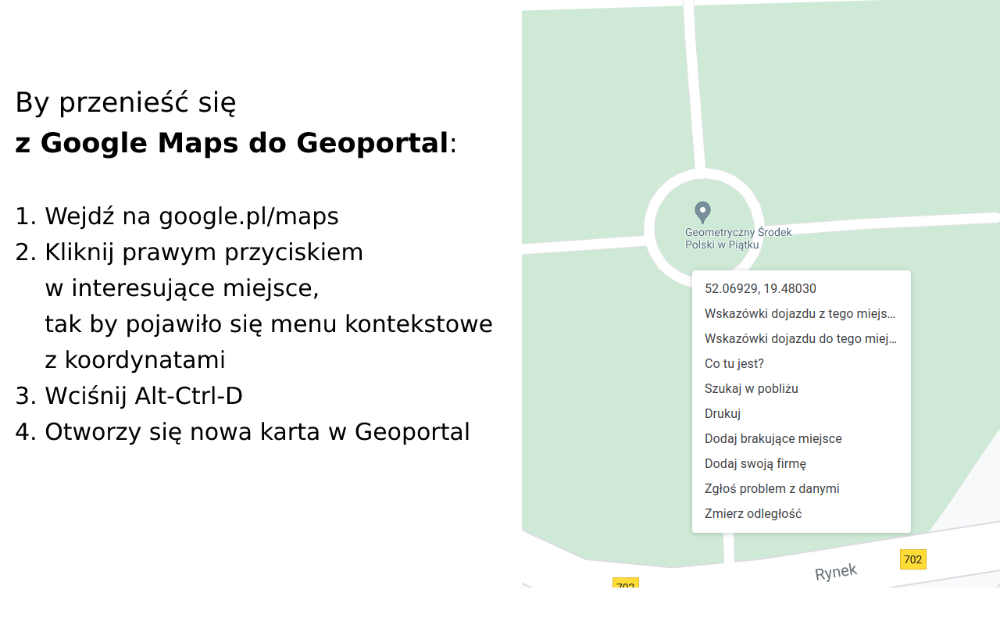

Podróżuj między Geoportal i Google Maps
----------------------------------------

## Instalacja

- [Chrome Web Store](https://chrome.google.com/webstore/detail/lokalizacja-geoportalgovp/bmalpmchldgpfnonnkephcfpblhipdhm)
- [Firefox](https://addons.mozilla.org/pl/firefox/addon/geoportal-google-maps/)

## Użycie

### Z Geoportal do Google Maps

https://mapy.geoportal.gov.pl

### Z Google Maps do Geoportal

https://www.google.pl/maps

### Konfiguracja

Skrót można zmienić w opcjach rozszerzenia.

- dla Chrome: [chrome://extensions/shortcuts](chrome://extensions/shortcuts)
- dla Firefox: https://support.mozilla.org/pl/kb/zarzadzanie-skrotami-klawiaturowymi-rozszerzen

---

## Development

Kod istnieje w dwóch wersjach z powodu niekompatybilnej konfiguracji `manifest.json` między przeglądarkami, zobacz
gałęzie:

- `platform/firefox`
- `platform/chrome` (tak jak `master`)

## Testowanie

### Chrome

1. `chrome://extensions/` > `Load unpacked` > `src`
2. `chrome://extensions/` > &#8635; (Reload)
3. Zamknij i przywróć kartę po każdej zmianie kodu

### Firefox

1. `about:debugging#/runtime/this-firefox` > `Load Temporary Add-on…` > `src/manifest.json`
2. `about:addons` > &#9881; (Settings) > `Update Add-ons Automatically`
3. Zamknij i przywróć kartę po każdej zmianie kodu

---

## Przygotowanie paczki do releasu

1. Podbij wersję w `manifest.json`
2. `(cd src && zip -r ../geoportalgovpl-to-googlemaps.zip .)`

---

## Inne:

1. https://mygeodata.cloud/cs2cs/
   Geoportal URL: ETRS89 / Poland CS92 (EPSG:2180)
2. Rozszerzenie wykorzystuje https://github.com/proj4js/proj4js
