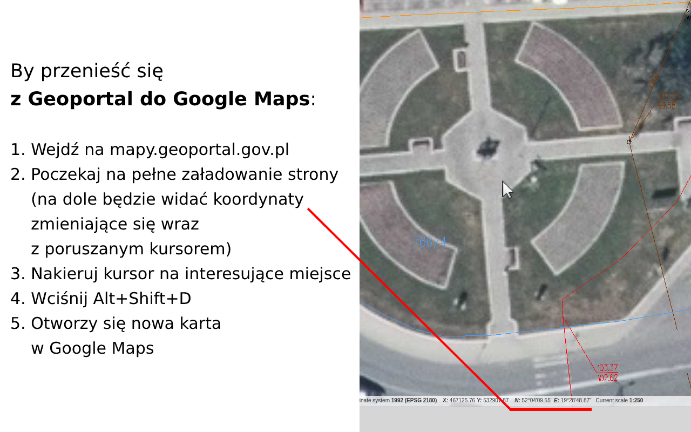

Przełączaj lokalizację między geoportal.gov.pl a Google Maps
----------------------------------------

## Instalacja

[Chrome Web Store](https://chrome.google.com/webstore/detail/lokalizacja-geoportalgovp/bmalpmchldgpfnonnkephcfpblhipdhm)

## Użycie

### Z Geoportal do Google Maps

https://mapy.geoportal.gov.pl
   

### Z Google Maps do Geoportal

https://www.google.pl/maps
   

### Konfiguracja

Skrót można zmienić w opcjach rozszerzenia.

- dla Chrome: [chrome://extensions/shortcuts](chrome://extensions/shortcuts))

## Development

### Przygotowanie paczki do releasu**

1. Podbij wersję w `manifest.json`
2. `(cd src && zip -r ../geoportalgovpl-to-googlemaps.zip .)`

###
Przydatne:
https://mygeodata.cloud/cs2cs/
Geoportal URL: ETRS89 / Poland CS92 (EPSG:2180)

###
Rozszerzenie wykorzystuje:
https://github.com/proj4js/proj4js

### TODO

- Firefox
- wydzielić ładniej kod

